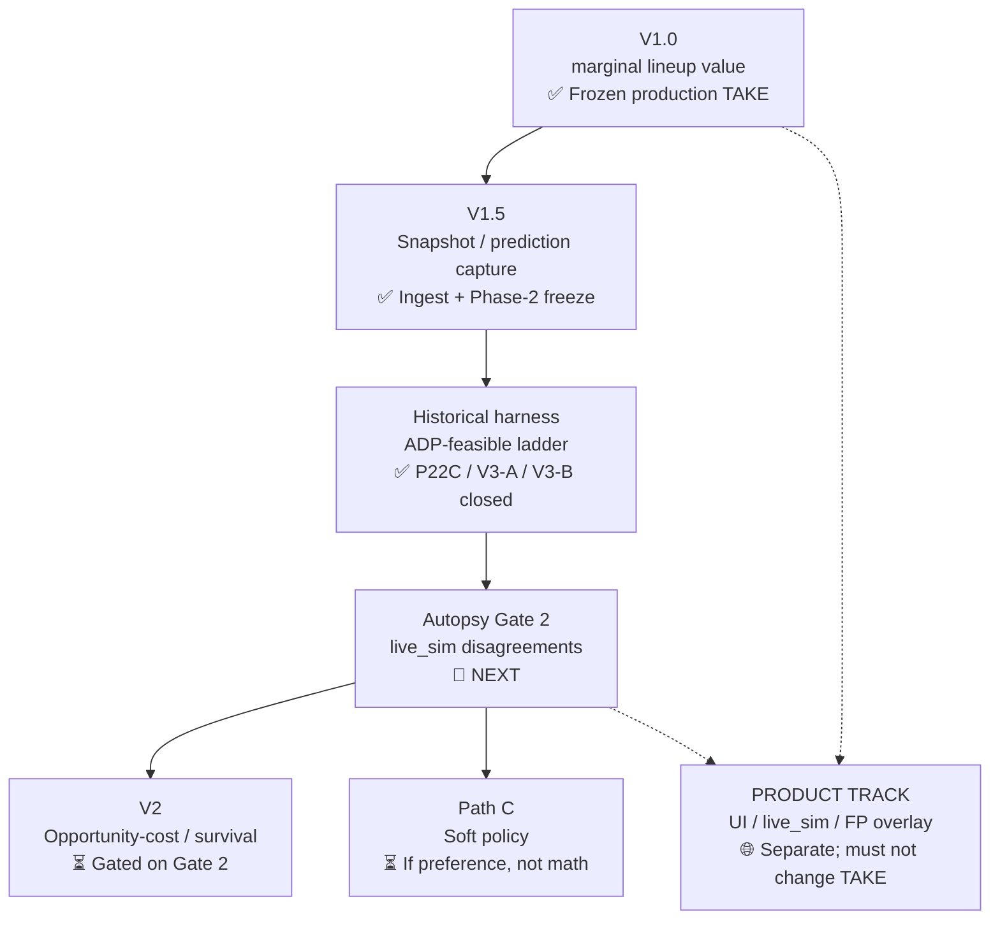
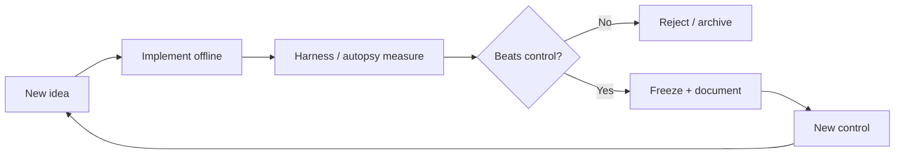

# Draft Optimizer Roadmap

**Experiment log:** [`docs/LAB_LOG.md`](docs/LAB_LOG.md) (hypotheses, completed tests, queued tests).  
**Methods:** [`docs/PROJECT.md`](docs/PROJECT.md).  
**Harness rules:** [`docs/HARNESS_SPEC.md`](docs/HARNESS_SPEC.md).  
**Integrity (not a version gate):** [`docs/FORMAL.md`](docs/FORMAL.md).  
**Live product rule:** [`results/AUTOPSY_GATE.md`](results/AUTOPSY_GATE.md).

**Core methodology:**

> FREEZE → CAPTURE → MEASURE → DIAGNOSE → IMPROVE → BACKTEST → FREEZE

A new version is not "more complicated." A new version is a demonstrably better
component backed by out-of-sample evidence.

---

## Version map



---

## Version table

| Version | Main problem | Success criterion | Prerequisite | Status |
|---|---|---|---|---|
| **V1** | Transparent draft baseline | Legal picks; FLEX-aware starter lift; reproducible | None | ✅ Frozen TAKE (`marginal`) |
| **V1.5** | No dated decision snapshots | Snapshots + `as_of` on ADP/proj | V1 | ✅ Active |
| **Harness** | Synthetic-only evidence | ADP→feasible→structural ladder under 2024 actual PPR | V1.5 | ✅ P22C complete (`evaluable=0`) |
| **V3-A** | Uncalibrated ADP-curve values | D beats C on mean with frozen train map; leakage gate | Harness | ✅ Supported / frozen (tradeoff noted) |
| **V3-B** | Construction overlays on D | Beat D on 2024 starter PPR | V3-A | ❌ Closed (inert or harmful) |
| **Autopsy G1** | Empty-board oddities | Classify Allen/Gibbs without shipping V2 | V1 | ✅ Closed |
| **Autopsy G2** | Live disagreement causes | Classify ~15 distinct modes; decide Path A/B/C | G1 | 🔄 **NEXT** |
| **V2** | Missing future-board value | Beat frozen `marginal` after live classification | Gate 2 = opportunity_cost cluster | ⏳ |
| **Path C** | Human preference ≠ math | Soft policy (e.g. no R1 QB) if that is the cluster | Gate 2 | ⏳ |
| **Product** | Usability | Latency, live_sim UX, FP overlay beside TAKE | Separate track | 🌐 |

---

## Version summaries

### V1.0 — Marginal starter value ✅

**Status:** Frozen production TAKE. UI / autodraft / ship readiness use raw `marginal` only.

**What it does:**
- Ingest: Sleeper identity, DynastyProcess IDs/ECR, ESPN ADP + PPR projections
- On your pick: score remaining pool by **marginal lineup lift** (FLEX-aware greedy starters)
- Tie-break: better ESPN ADP, then FantasyPros ECR, then name
- CPU opponents: ADP + noise (research / practice room)

**Not authorized in TAKE:** VOR, V2-alpha survival/lookahead, V3 construction, FP projections as ranking input, CVaR / robust-min.

**Known limitations (do not "fix" without a gated experiment):**
- Scarcity-blind (no survival / opportunity cost)
- ESPN season projections only (no multi-source blend in V1)
- Empty-roster R1 prefers high-proj QB when M gap is small (Gate 1)

---

### V1.5 — Capture ✅

Dated raw snapshots under `data/raw/`; SQLite `data/draftopt.db`; Phase-2 eval DB freezes with `snapshot_id` / `snapshot_date` / `as_of` fields.

Without capture, every historical claim is contaminated by knowing the outcome first.

---

### Historical harness ✅

Phase-2 ADP structural track under contract `ppr_eval_v1_2024`, snapshot `2024-preseason-2024-09-01-ffc12`.

Load-bearing result: **valuation gain C−B > 0** after feasibility + DST controls (preliminary; `evaluable=0`).  
See [`docs/HARNESS_SPEC.md`](docs/HARNESS_SPEC.md) and [`docs/LAB_LOG.md`](docs/LAB_LOG.md).

---

### V3-A — ADP calibration ✅ frozen

Train 2021–2023 FFC ADP → isotonic position maps; apply to 2024 ADP as `season_points` under **identical** structural construction as C.

**D−C:** mean ≈ +22, WR 55%, fat left tail (tradeoff). Instrument frozen — do not retune from 2024 Δ.

---

### V3-B — Construction ❌ closed

Licensed menu B.0 / B.1 / A / B: policy-inert or harmful vs D. Checkpoint `6ad702b`.  
No construction retune. Closing V3-B does not reopen V2 or authorize Path A.

---

### Autopsy Gate 2 — live_sim 🔄

**Current research bottleneck.** Collect disagreements as felt; classify; only then Path A/B/C.

Stubs frozen (crude ADP sigmoid + ADP-greedy `two_pick_ev`). Do not improve survival models until Gate 2 says opportunity cost dominates.

Loop: **Frozen `marginal` → live_sim → dump + disagree → offline analyze → classify → only then Path A/B/C.**

---

## Version gate



Every new version must answer: **what measurable weakness in the previous model
am I fixing, and did fixing it actually improve the agreed metric?**

Formal integrity ([`docs/FORMAL.md`](docs/FORMAL.md)) is **not** a version gate. It checks that
the compare still measures the same question.

---

## Operational sequence (now)

```text
PRODUCTION
  TAKE = marginal (frozen)
  live_sim + autopsy instrumentation on
  FP overlay beside TAKE only

RESEARCH (authorized)
  Autopsy Gate 2: log disagreements, classify modes
  Do not ship survival / VOR / construction into TAKE

BLOCKED until Gate 2 classification
  Path A (new ranking engine)
  Better P(survive) / lookahead
  New construction overlays
  Retuning V3-A map from 2024 outcomes
```
