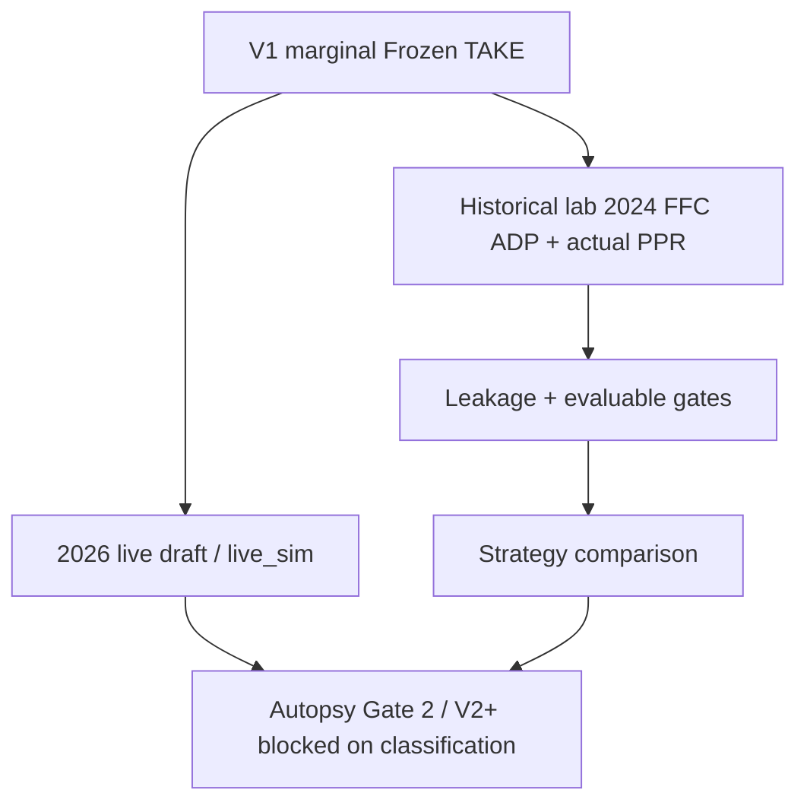

# Historical Harness Specification

> **A backtest result is not evidence until the harness has demonstrated that the
> decision snapshot contains only information available at that cutoff, and that
> `recommend()` cannot see outcomes.**

This document locks Phase-2 as-of-T rules. Detailed milestone history lives in
[`../results/PHASE2_HISTORICAL_EVAL.md`](../results/PHASE2_HISTORICAL_EVAL.md).
Verdicts live in [`LAB_LOG.md`](LAB_LOG.md).

---

## Three parallel tracks



---

## Architecture (locked)

```text
Decision-time DB  (ADP, projections, pool, dates)
        |
        v  recommend()  -->  ZERO access to outcomes
 simulated draft (player IDs only)
        |
        v
Outcome DB  (actual season PPR, independent)
        |
        v  score after draft complete
 realized starter points
```

### Hard rules

1. **`recommend()` must have zero access to the outcome database.**
2. Soft join only: draft emits **`player_id`s**; outcomes attach later.
3. Leakage constraint (pipeline hard-fail): `source_as_of <= snapshot_date`
4. Outcome scoring uses the **same roster slots** as the league (default PPR: QB, 2 RB, 2 WR, TE, 2 FLEX, DST, ...).
5. Phase-1 synthetic simulator (ESPN-proj scoring) is a **lab**, not the definition of historical success.
6. Label markets honestly: FFC ADP != ESPN ADP; 12-team != 10-team; ECR != `proj_ppr`.

Implemented checks: `draftopt.phase2.leakage`, `draftopt.phase2.evaluable`, `validate_snapshot`, `assert_evaluable`.

---

## Snapshot kinds

| Kind | Flags | Allowed for |
|---|---|---|
| **PIPELINE PROOF** | `pipeline_proof=1`, `evaluable=0` | Ingest / leakage validation only |
| **EVALUATION** | `pipeline_proof=0`, `evaluable=1`, `outcome_season` set | Replay, scoring, strategy compare |

Hard gate: `require_evaluable(conn, snapshot_id)` raises `SnapshotNotEvaluable` otherwise. Never mutate a frozen id's meaning; mint a new dated id for a new cut.

**Current research ladders (P22C / V3-A / V3-B) report `evaluable=0`.** They are methodology / mechanism evidence under a frozen contract, not a claim of a fully green evaluation snapshot. Do not quietly promote them to `evaluable=1` without re-running the gate.

---

## Field provenance (as-of snapshot T)

| Input | Allowed at decision time | Notes |
|---|---|---|
| Player identity / team / pos | Yes | Sleeper + DynastyProcess crosswalk |
| Preseason ADP with `as_of <= T` | Yes | FFC for P22C structural; ESPN for live V1 |
| Preseason projection with `as_of <= T` | Yes | ESPN for V1 TAKE; calibrated ADP curve for D |
| Draft slot / league slots | Yes | |
| Actual season PPR | **Scoring only** | Attach after draft |
| In-season injuries / weekly news | No (preseason harness) | Unless experiment is explicitly in-season |
| End-of-season rankings | No | |

### Type-level cutoff vs provenance

Both required; neither implies the other. See [`FORMAL.md`](FORMAL.md).

| Layer | Guarantees | Does not guarantee |
|---|---|---|
| **Provenance** (this doc, leakage module) | Columns built from sources allowed at T | Later Python cannot still cheat |
| **Type / API cutoff** (FORMAL) | Predictor of Snapshot T has no outcomes parameter | Allowed fields were themselves honest |

---

## Baselines used in Phase-2 ladders

| ID | Strategy | Role |
|---|---|---|
| A | `adp_baseline` | Pure ADP pick order |
| B | `adp_feasible` | ADP with roster feasibility |
| C | `adp_structural` | Feasible + structural / marginal-style valuation on ADP curve |
| D | `adp_v3a` | Same construction as C; V3-A calibrated `season_points` |

**Load-bearing contrasts:** B-A (feasibility), C-B (valuation), D-C (calibration).  
Do not use total-vs-baseline alone to authorize a new TAKE.

---

## Scoring contract

Primary historical metric: **realized starter PPR** under the league slot set (contract id e.g. `ppr_eval_v1_2024`).

Report full starter, ex-DST, and other declared slices **without** cherry-picking the slice that flatters the challenger after seeing results.

Paired boards: shared sim seed + opponent policy held fixed across strategies being compared.

---

## CLI reference

```powershell
# Freeze live ESPN cut (pipeline proof by default)
python -m draftopt.phase2.freeze_snapshot

# Validate leakage / schema
python -m draftopt.phase2.validate_snapshot 2026-preseason-2026-08-12

# Must REFUSE pipeline-proof ids
python -m draftopt.phase2.assert_evaluable 2026-preseason-2026-08-12

# Synthetic lab (ESPN proj scoring — not Phase-2 actuals)
python -m draftopt.backtest --n 50 --slot 1 --seed 0
```

---

## Research sequence (current)

1. Harness + P22C ladder — **done** (preliminary C-B support).
2. V3-A calibration — **frozen**.
3. V3-B construction — **closed**.
4. **Autopsy Gate 2** — live disagreements under frozen `marginal`.
5. Only after classification: Path A / B / C (see [`../results/AUTOPSY_GATE.md`](../results/AUTOPSY_GATE.md)).
